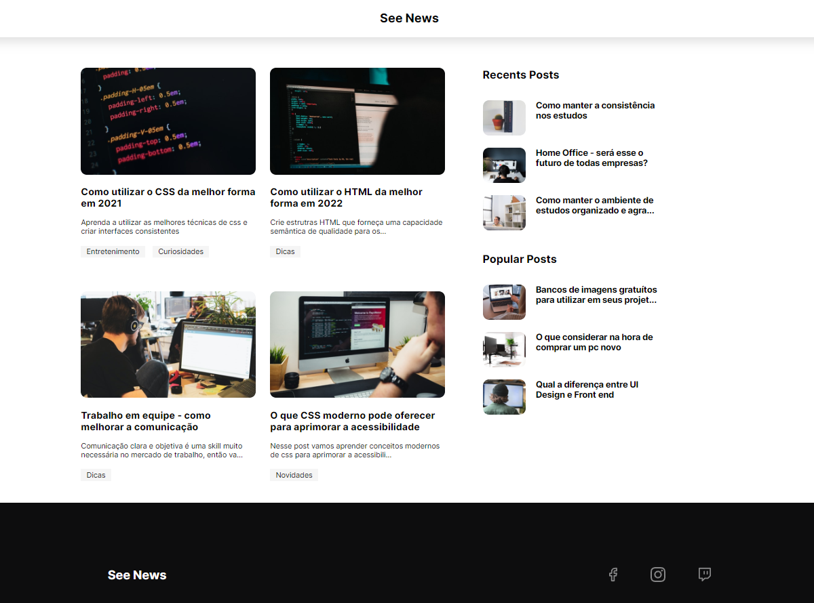

# Random Blog Flexbox

<h2>Preview<h2>

    
    

<h3>Sobre</h3>

Pequeno projeto de recriação de um Blog utilizando flexbox proposto pela Kenzie Academy Brasil. Nesse projeto utilizei somente 2 Media Query para deixar a página totalmente responsiva juntamente utilizando a propriedade de Porcentagem(%)!!! Ao final adicionei uma sessão com todas as minhas redes sociais.

